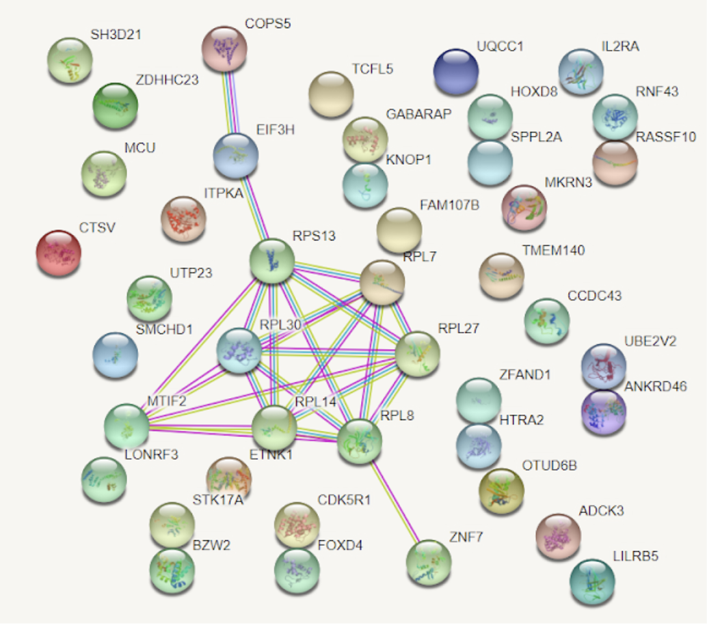
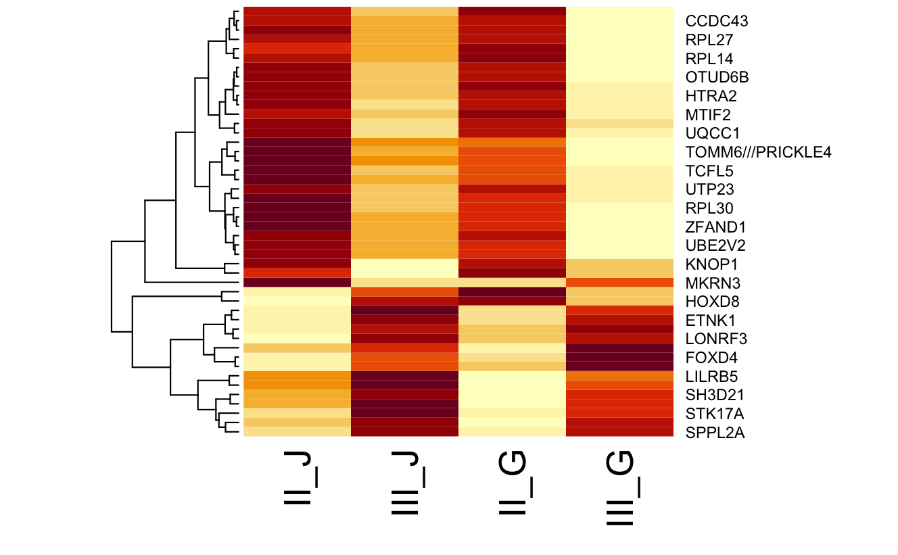

# Genes en cancer de colon
Identificación de biomarcadores en cancer de colon 

En este proyecto colaborativo se realizó un análisis de Microarray de la expresión de biomarcadores en Cáncer de Colon.
 
Se utilizó el lenguaje R y en el Notebook es posible apreciar el tratamiento y análisis estadístico de muestras de pacientes de diferente raza y edades con cáncer de colon. Las bases de datos utilizadas se obtuvieron de *Geo Datasets*

Encontraremos en el pdf el desarrollo del proyecto desde sus inicios como el análisis e interpretación de los resultados. 

